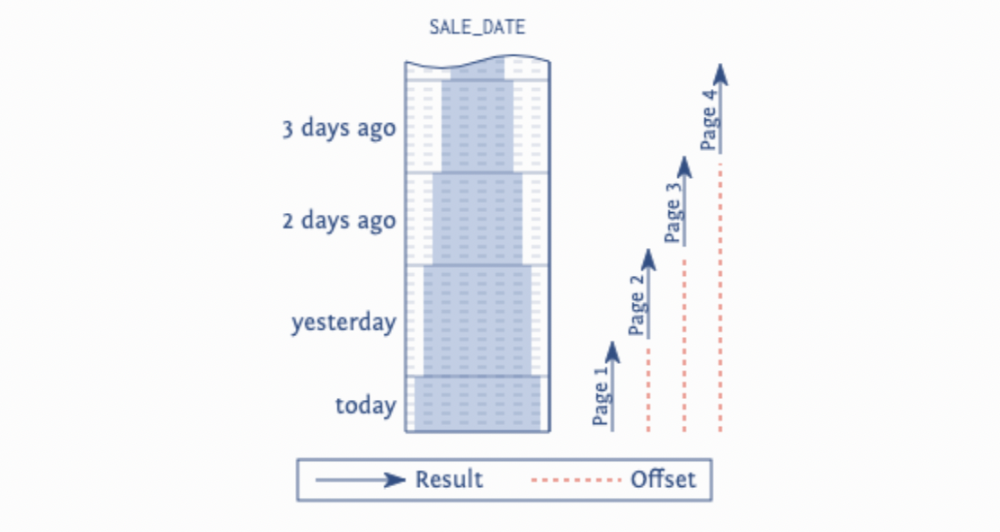
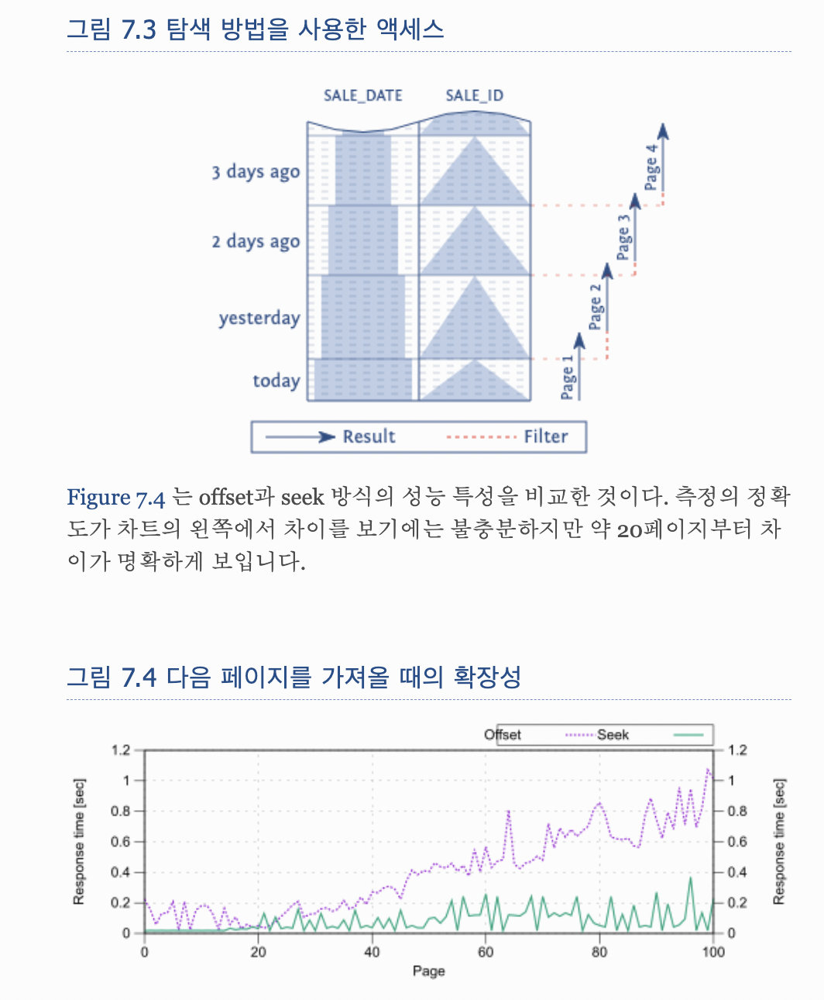

# 페이지네이션 방식 (offset 의 성능 저하)

일반적인 페이지네이션 방식

```sql
SELECT *
FROM table
WHERE {condition}
LIMIT {contents 개수} OFFSET {page number}
```

데이터베이스는 처음부터 요청된 페이지에 도달할 때까지 모든 행을 계산해야 한다. 아래 이미지는 더 많은 페이지를 가져올수록 스캔된 인덱스 범위가 더 커지는 것을 보여줍니다.


_index 스캔 범위_

## offset 방식의 장점

이 방식은 이해하기 쉽고, 빠르게 개발이 가능하다.
별도의 페이지네이션을 위한 인덱스 설계 없이 `offset = (page - 1) * size` 라는 식만 이해한다면 구현이 가능하다.

그리고 우리에게 익숙한 게시판 형태의 페이지네이션 구조 구현이 가능하다. 
첫 화면에 들어와 원하는 페이지를 마음대로 누르거나, 사이즈를 동적으로 조정한다거나, 심지어는 URL 에 query string 으로 page, size 를 가지고 redirect 시에 바로 원하는 화면까지 볼 수 있다.

그리고 정렬조건이 복잡하거나, 자주 변경될 수 있는구조라면 이는 더할나위 없이 좋은 방식이다.

## 단점

다만 단점도 있다.
위에 보이는 이미지 처럼 데이터량이 많아져 페이지가 많아질 수록 성능이 급격하게 저하된다. 이는 데이터베이스의 부하가 커진다고 봐도 무방하다.
그리고 내가 이미 봤던 페이지에 새로운 데이터가 생겼다면 중복되는 데이터가 페이지네이션 결과로 노출될 수 있다.
그리고 위 장점에 적은 우리에게 익숙한 게시판 형태의 구현이 불가능하다.
(use-the-index-luke.com 에선 페이지 번호를 표시해 임의의 페이지로 이동하는 인터페이스가 poor navigation 이라고까지 말한다.)


---

이러한 방식을 개선하려면 seek method, keyset pagination 등으로 불리는 방법으로 해결할 수 있다. 데이터량이 많거나 무한스크롤과 같은 방식의 UI 에서는 충분히 고려해볼만 하다.
(cursor pagination, no-offset pagination 이라고도 불린다)

간단하게는 이런 모습이다.
```sql
SELECT ...
  FROM ...
 WHERE ...
   AND id < ?last_seen_id
 ORDER BY id DESC
 FETCH FIRST 10 ROWS ONLY
```
마지막 봤던 데이터 이후의 페이지를 페치하는 방식이다. (이러한 방식 때문에 게시판 형태의 페이지를 노출하는 방식은 구현이 어렵다)

보통은 이런 id 가 아닌, 날짜 기반의 정렬 (order by sorting) 이 들어가는데, 이는 같은 날짜를 가진 여러 데이터가 있기때문에 또 까다롭다.
그럴 땐 위와 같은 예제처럼 PK 기반의 id 와 같은 unique 한 값으로 별도의 복합 index 설계가 필요할 수 있다.

```sql
CREATE INDEX sl_dtid ON sales (sale_date, sale_id)
SELECT *
  FROM sales
 WHERE (sale_date, sale_id) < (?, ?)
 ORDER BY sale_date DESC, sale_id DESC
 FETCH FIRST 10 ROWS ONLY
```

정렬조건이 복잡하거나, 매번 변경된다고 하면 사실 적용하기 정말 어렵다고 봐도 무방하다.


_index 스캔 범위, 확장성_

이미지와 같이 데이터가 많거나 페이지가 늘어날 수록 확연하게 좋은 성능 벤치마크를 보여준다.


참고
- https://use-the-index-luke.com/sql/partial-results/fetch-next-page
- https://use-the-index-luke.com/no-offset
- https://vladmihalcea.com/keyset-pagination-spring/
- https://betterdev.tistory.com/17
- https://binux.tistory.com/148
