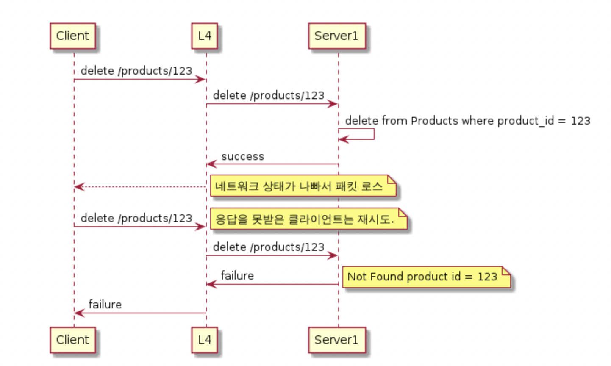

# 멱등성 (idempotence)

> 연산을 여러 번 적용하더라도 결과가 달라지지 않는 성질

REST API 의 HTTP GET Method 를 예로 들면, 요청과 응답이 동일해야 하나라고 생각할 수 있지만 그런 얘기는 아니다. 서버측에 어떤 변화가 있는 것은 아니며 이 또한 멱등으로 볼 수 있다.

PUT, DELETE, TRACE 및 GET, HEAD, OPTIONS가 멱등성을 갖는다.

PUT과 POST의 차이점은 PUT은 멱등하다는 것이다.

POST는 클라이언트가 리소스의 위치를 지정하지 않았을 때 리소스를 생성하기 위해 사용하는 연산이다. PUT과 POST는 멱등성과 리소스 결정권에 따라 나뉜다고 볼 수 있다. 
멱등성을 갖지 않고 리소스를 서버가 결정하면 POST, 멱등성을 가지고 있으며 리소스를 클라이언트가 결정하면 PUT!

원격지 웹 서버에 파일을 삭제하기 위해 사용되며 PUT과는 반대 개념의 메소드이다. (not POST)

서버에게 요청 URL로 지정한 리소스를 삭제할 것을 요청한다. 클라이언트는 삭제가 수행되는 것을 보장하지 못한다. HTTP 명세에는 서버가 클라이언트에게 알리지 않고 요청을 무시하는 것을 허용하기 때문이다.

보통 대부분의 경우 Idempotent하면 safe한데, DELETE는 Idempotent하지만 리소스를 변경하므로 safe하지 않다.

## PATCH는 왜 멱등성이 보장되지 않는다는걸까?

사실 PATCH 메소드는 구현 방법에 따라서 PUT 메소드처럼 멱등성이 보장될 수도 있고, 혹은 보장되지 않을 수도 있다.
PATCH 메소드는 PUT 메소드처럼 리소스를 대체하는 행위가 아니기 때문에 요청을 어떤 방식으로 사용하는지에 대한 제한이 딱히 없기 때문이다.
RFC 스펙 상의 PATCH 메소드는 단지 리소스의 일부를 수정한다는 의미만을 가질 뿐이다.

예를 들어, PATCH 메소드에 수정할 리소스의 일부분만 담아서 보내는 경우에는 당연히 멱등성이 보장된다. 
이와 달리, 리소스의 일부분이지만 호출 할 때마다 값이 증가하거나, 변하는 경우 멱등성이 보장된다고 할 수 없다.

## 멱등성을 고려하며 작업하기

_멱등성을 고려해야하는 이유_

클라이언트(요청부)와 서버(응답부) 간의 고려가 필요한 모습, 기대한 응답이 오지 않을경우 고려가 항상 필요하다.

서비스 간의 응답은 여러 이유로 정상적으로 오지 않을 수도, 기대한 대로 오지 않을 수 있다. 응답을 수신하지 못할 경우 다른 방법으로 처리할 수 있는지에 대한 고민이 항상 필요하다. 
_재고서비스 장애로 재고 응답이 오지 않아도 우선 예약을 받고 서비스 복구 이후 수기로 대응을 하는 방안을 고려해본다거나.._

_추가로 알아두면 좋은 개념_

## 안정성 (Safe)

HTTP는 안전한 메서드라 불리는 메서드의 집합이다.

안전한 메서드의 목적은 서버에 어떤 영향을 줄 수 있는 안전하지 않은 메서드가 사용될 때 사용자들에게 그 사실을 알려줄 수 있도록 하는 것이다.

읽기 전용인 경우 안전한 메서드로 간주하며, GET, HEAD, OPTIONS 메서드는 안전한 메서드로 정의되어 있다.

즉, 리소스를 수정하지 않는 메소드들을 Safe 하다고 말한다.
