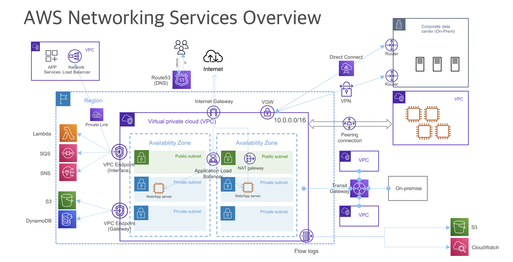

# AWS Network session

aws자원레벨
- 리전 사용 없이 global resource
- Regional resource
- AZ level resource

—————

- Region ( internet gateway 를 통해 VPC 와 통신해야함)
    - VPC (주소 range 정의 해야함)
        - VPC peering 을 통해 VPC 간 연결 1:1 로 가능 (region 이 다르더라도)
        - Transit gateway 는 direct connect 뿐 아니라 다른 모든 VPC 간 mesh 형태의 connection 을 운용 가능
        - VPN (VPC 와 외부를 연결하기 위함)
    - AZ (고가용성을 위한 권고)
    - EC2 (public subnet, private subnet internet gateway 를 통한 통신 가능한지 안한지에 대한)
        - Internet gateway -> ALB 를 통해 -> private subnet ec2 로 통신 가능
        - NAT gateway 는 ALB 없이 가능
    - S3, DynamoDB 같은 저장소 (VPC endpoint (gateway) 를 통해 통신 가능)
    - SQS, SNS, Lambda (VPC endpoint (interface) 를 통해 통신 가능 위 gateway 와는 비용 발생에 대한 차이)

---

VPC
- 독립된 가상의 클라우드 네트워크 (주소 공간)
- Security group, ACL, subnet, ip 대역 등에 대한 네트워크 환경 설계 및 제어 (CIDR)
- Network ACL (access control) 은 서브넷 단위로 적용 (in/out 둘다 명시해야함)
- Security group 은 instance 단위로 적용  (세션을 기억하고 있기때문에 in 만 필요함)

VPC endpoint
- Private -> AWS SNS 서비스로 internet 을 통해 나가야한다면
- Private -> NAT gateway -> public -> internet gateway -> SNS 로 가야하는데, VPC endpoint 는 internet 을 통하지 않고 가능. 비용 효율

---

-ELB
    - 여러 타겟으로 트래픽 분배 (EC2, containers, ip, lambda 같은..)
    - 자동으로 확장 ASG (Auto sailing group) 지원
- NLB
    - L4 layer (IP, port 기준으로만)
      - 낮은 지연률, 높은 성능
- ALB
    - L7 (http 까지)
    - 보안을 위한 TLS 까지 
- GWLB (Gateway load balancer)
  - 3rd party 제품을 수평적 확장하게 지원 (예를 들면 보안 장비들)
  - GWLB subnet 을 만들어서 거치는 방식 

