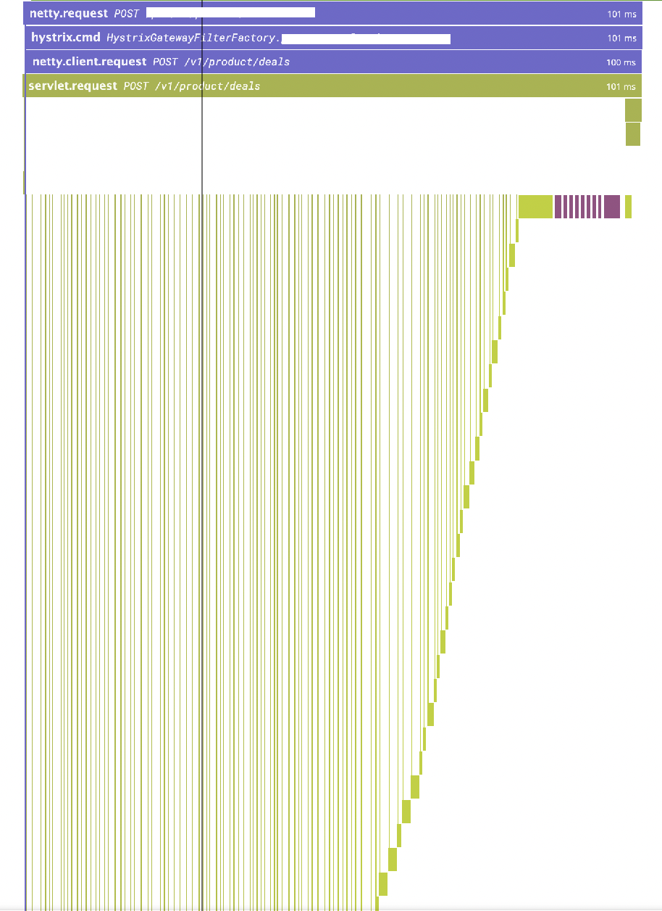
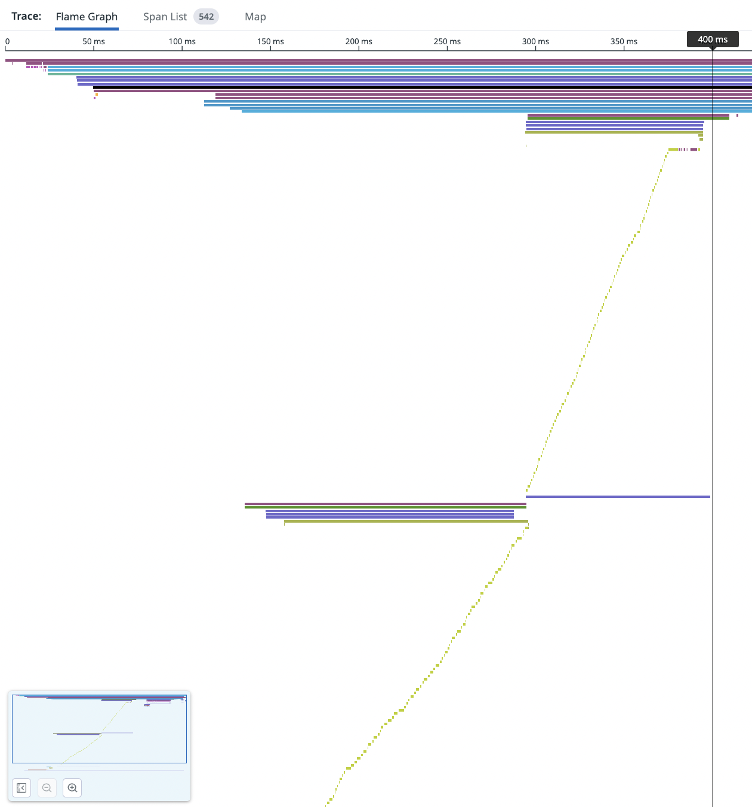

# Redis Cluster 구성으로 사용시  MGET 이슈


_mget 시 엄청나게 많은 hash slot 을 조회하는 모습_



_레이턴시의 주 원인_

cache 를 활용하려고 redis 를 사용하니, cluster 환경에서 실시간 조회나 큰 차이가 없다. 아니.. 오히려 느리다.
해서 보니, mget 이 수만개의 슬롯을 뒤지고 있었다. 

---

[hash tag](https://redis.io/docs/reference/cluster-spec/ ) 를 활용하면 cluster 환경에서 hash slot 수를 제한할 수 있다.

database sharding, kafka partition key 와 같은 느낌이 난다.

```java
// before
private static final String FORMAT = "some-prefix:%d";
var key = String.format(FORMAT, division, someId);
        
// after
private static final String FORMAT = "{some-prefix:%d}:%d";
var key = String.format(FORMAT, division, someId);
```

