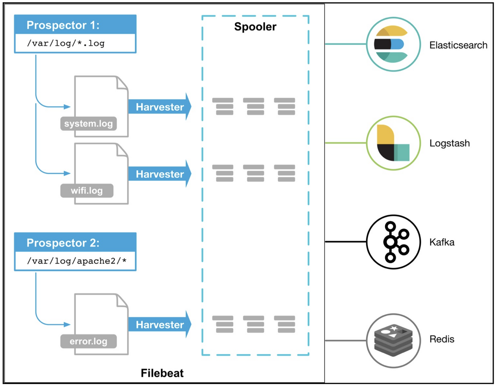
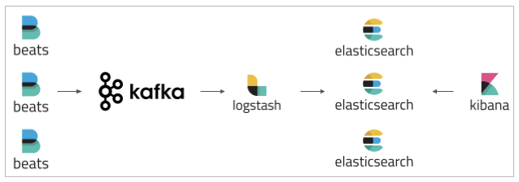

# Filebeat? 

ELK Stack에서 중요한 보조 수단. 애플리케이션에서 File을 통한 로그데이터를 주기적으로 스캔해 쌓이고 있는 데이터를 긁어오는 역할을 하는 것이 파일비트이다. 

파일비트가 지원하는 Input 타입은 log와 stdin이 있다. 

## 구성요소

_filebeat_

파일비트는 Prospectors, Harvesters, Spooler라는 주요 구성 요소를 가지고 있다. 다수의 Prospector, Harvester로 이루어진다.

- Prospector는 로그를 읽을 파일 목록을 구분하는 역할을 담당한다. 여러 파일 경로를 설정하면 로그를 읽을 파일을 식별하고 각 파일에서 로그를 읽기 시작한다. 
- 이때 파일 컨텐츠, 즉 이벤트 데이터(로그)를 읽는 역할은 Harvester가 담당한다. 파일을 행 단위로 읽고 출력으로 보낸다. 
  - 하나의 Harvester가 개별로 파일을 담당하며 파일을 열고 닫는다. 읽어올 파일 수가 여러개가 되면 그에 따라 Harvester도 여러개가 되는 것이다. 
- 이벤트가 발생하여 읽어온 로그데이터는 Spooler에게 보낸다. 그리고 Spooler는 이벤트를 집계하고 설정할 출력으로 전달한다.

물리적인 파일을 읽는데 어디까지 읽었고, 출력은 어디까지 보냈는지에 대한 정보는 Harvester가 offset으로 디스크에 주기적으로 기록하며 이는 레지스트리 파일에서 관리한다. 

엘라스틱서치, 카프카, 레디스 같은 출력 부분 미들웨어 시스템에 문제가 발생하면 파일비트는 마지막으로 보낸 행을 기록하고, 문제가 해결될때까지 계속 데이터를 수집하고 있는다. 

이러한 관리 덕분에 파일비트를 내렸다 다시 올려도 데이터의 위치를 기억한 상태에서 기동되게 된다. 

또한 Harvester 같은 경우 출력에게 데이터를 보낸 후에 출력 부분에서 데이터를 잘 받았다는 응답을 기다리는데 해당 응답을 받지 않은 경우 다시 데이터를 보내게됨으로 반드시 한번은 데이터 손실없이 보내게 된다.

## 구현

가장 기본적인 구현 방식은 filebeats 와 logstash 를 연동하는 방식이다. filebeat 의 output config 를 Logstash address 로 연동해 logstash 에 로그데이터를 저장하고 가공할 수 있게 한다.

console, redis, elasticsearch 등 다양한 Output 선택지가 있지만, kafka 를 통한 구현 방식도 있다. 이는 filebeat 가 producer 의 역할을 하게 된다.
이때 logstash 는 consumer 의 역할을 하게 된다. (실제로 kafka topic 의 consumer group 에 logstash 가 연결 됨)

그리고 logstash 로 데이터를 filebeat 가 밀어넣고, 그 뒤 가공을 통해 logstash 에서 kafka 로 output(produce)을 내보내는 방식으로 구현할 수도 있다. 이는 logstash 가 producer 의 역할을 하게 된다.

### Why kafka

_filebeat with kafka_

어떠한 이유로 ELK 스택이 다운되었을 때, 저장하지 못한 로그를 보관하기 위해 Apache Kafka 를 이용한다.

가장 큰 이유 중 하나는 트래픽이 몰리면 Logstash, Elasticsearch 만으로는 부하를 견디기 힘들다. (Logstash는 sharding과 replication 등을 지원하지 않기 때문)

kafka 는 여러 partition 을 통해 message 들을 관리하고, 여러 파티션을 여러 애플리케이션 인스턴스들이 잘 분배해 컨슈밍 해 갈 수 있기 때문에 고가용성 확보에 뛰어난 강점이 있다.

_참고_
- https://coding-start.tistory.com/187
- https://discuss.elastic.co/t/filebeat-define-custom-ingest-node-for-kafka-output/259032/3
- https://www.skyer9.pe.kr/wordpress/?p=164

