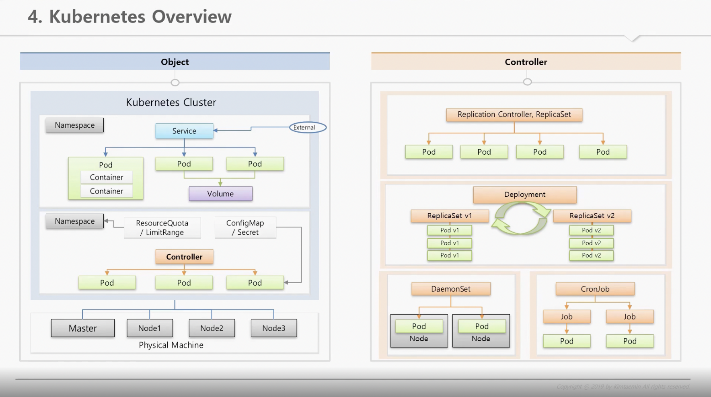

# 대세는 쿠버네티스 인프런

컨테이너 가상화기술은 서비스간 자원격리를 하는데 OS 를 별도로 안띄워도 된다, 이 OS 기동시간이 없어서 자동화시에 빠르고 자원효율이 매우 높다

도커가 유명세를 탔다. 하나의 서비스는 괜찮지만, 많은 서비스를 일일이 배포하고 운영하는 게 힘들었다. (이런걸 하는 게 오케스트레이터)
rancher, docker swarm, 쿠버네티스 등도 여기 포함 됨

쿠버네티스가 곧 표준이 된 것 처럼 대세가 되어 google, aws, azure 등에서 대응

--- 

## vm

- host os 위에 hypervisor 위에 별도의 os 를 다시 띄우는 개념

- 서비스 확장시 guest os 를 추가로 띄워야함 (여기 안에 서비스, 모듈이 있으니)

## container

- host os 위에 os 에서 제공하는 자원격리기술을 통해서 컨테이너란 단위로 서비스를 분리할 수 있음
  - namspace (kernel 에 관련 된 영역)
  - cgroups (자원에 관한 영역)

- k8s 는 pod 라는 배포 단위마다 확장가능 (컨테이너별 확장 가능)

---

Pod는 애플리케이션의 실행을 담당하고, Service는 네트워크 서비스를 제공합니다.

## Pod

- Kubernetes의 기본 실행 단위. 하나 이상의 컨테이너로 구성되어 애플리케이션의 프로세스를 실행합니다.
- 동일한 호스트에서 실행되며, 공유 네트워크 네임스페이스와 볼륨을 사용하여 컨테이너 간에 통신과 데이터 공유를 할 수 있습니다.
- 관련 컨테이너들이 함께 작동해야하는 경우에 사용됩니다. 예를 들어, 웹 서버와 데이터베이스 서버가 동일한 Pod에서 실행될 수 있습니다.

## Service

- Kubernetes 클러스터 내부 및 외부에 있는 Pod에 대한 네트워크 서비스를 제공하는 추상화입니다.
- Pod에 대한 로드 밸런싱, 서비스 디스커버리, DNS 이름을 제공하고, 네트워크 주소가 변경되어도 클라이언트가 Pod에 접근할 수 있도록 합니다.
- 여러 Pod 인스턴스를 단일 가상 IP 주소로 그룹화하고, Pod 집합에 대한 네트워크 트래픽을 분산시키는 로드 밸런서 역할을 수행합니다.
  - 웹 애플리케이션을 실행하는 여러 Pod가 있을 때, Service를 사용하여 웹 트래픽을 Pod 그룹으로 분산시킬 수 있습니다.

---

overview

- Cluster
  - Kubernetes 시스템의 전체적인 인프라스트럭처입니다.
  - 노드(node)라고 불리는 여러 개의 컴퓨터(호스트)로 구성되어 있으며, 이러한 노드는 애플리케이션을 실행하고 관리하는데 사용됩니다.
  - 마스터 노드(master node)와 워커 노드(worker node)로 구성됩니다. 마스터 노드는 클러스터의 제어 플레인(control plane)을 관리하고, 워커 노드는 실제 애플리케이션 실행을 처리합니다.

- Namespace:
  - 클러스터 내의 가상적인 분리된 환경을 제공하는 방법입니다.
  - 각각의 Namespace는 클러스터 안에서 리소스의 범위를 제한하는 논리적인 경계를 형성합니다.
  - 클러스터 안에서 리소스의 이름 충돌을 방지하고, 여러 사용자 또는 팀이 동시에 사용하는 경우 리소스를 구분하는 데 도움이 됩니다.
  - Pod, Service, ReplicaSet, Deployment 등과 같은 Kubernetes 리소스를 그룹화하고 구성하는 데 사용됩니다.
    - 여러개의 서비스 (당연히 pod 도) 를 가질 수 있음
  - 기본적으로 Kubernetes 클러스터는 "default"라는 기본 Namespace를 가지고 있으며, 사용자는 필요에 따라 추가적인 Namespace를 생성할 수 있습니다.

- 클러스터는 Kubernetes의 전체 인프라스트럭처를 나타내는 개념입니다.
- Namespace는 클러스터 내에서 리소스를 그룹화하고 분리하는 논리적인 단위입니다.
- 클러스터 안에는 하나 이상의 Namespace가 존재할 수 있으며, 각 Namespace는 독립적으로 운영될 수 있습니다.
- 동일한 클러스터 내에서 서로 다른 Namespace에 속한 리소스는 서로 분리되어 있으며, **한 Namespace의 리소스는 다른 Namespace에서 직접 접근할 수 없습니다.**
- Namespace는 다른 Namespace 간에 리소스 공유를 위한 방법을 제공할 수도 있습니다. **예를 들어, 하나의 Namespace에서 생성된 Service는 같은 클러스터 내의 다른 Namespace에서 접근할 수 있습니다.**

---

한 파드에서 여러 컨테이너가 존재할 때, 컨테이너끼리 같은 포트를 쓸 순 없음. 한 컨테이너가 여러 포트를 가질 순 있다. (이런 경우 한 호스트로 엮여있는 상태)

label 은 파드별로 줄 수 있음 (환경과 같은 값을 key value 형태로 줄 수 있음)

파드가 노드에 올라 갈 때 파드에 노드를 직접 셀렉트 할 수 있음. (라벨 기반으로)
쿠버네티스의 스케줄러가 직접 판단해서 (노드별로 사용중인 파드의 메모리, CPU 사용량 등을 계산) 올라갈 수 있음

Cluster > node > pod > container
service 는 Pod 그룹 또는 다른 Service에 대한 네트워크 서비스를 제공하는 추상화된 리소스
- clusterIP (default) (인가 된 IP 에 대한 접근. 내부 백오피스, 대시보드 같은 서비스에서 ??)
- nodePort (잠깐 노드포트를 열어서 데모를 보여주거나 할 때 말곤 안쓸 듯)
- loadBalancer (보통 외부에 노출 할 때)

Volume
- emptyDir
  - Pod 단위라서 재생성 될 때 삭제됨, container 끼리 공유 가능
- hostPath
  - Node 단위라서 파드가 재생성 될 때 삭제되진 않지만 파드가 다른 노드에 생성 되면 공유할 수 없음
- PVC / PV (Persistence Volumne, Persistence Volume Claim)
  - Pod -> PVC -> PV 순으로 연결됨
권한, 사양(storage size) 등에 따라 pvc 가 pv 에 연결해줌

---

Object
- ConfigMap
  - 단순한 환경 변수들
  - 이미지를 환경변수마다 만드는 게 아니라 한 이미지에서 이 환경변수들을 주입받아서 기동
- Secret
  - Memory 에 올림 (보안측면)
  - 1MB 까지
  - base64 인코딩 형태로 설정해야함
    - 파드로 주입 될 때 decoding 됨

literal
file
- configmap 에 데이터를 변경하면 파드가 재 생성되어야 수정이 됨
volume mount
- Mount 라는 특성상 configmap 내용이 변경되면 동기화 되는 특성

LimitRange, ResourceQuata 와 같이 리소스 사용율등을 제한해서 네임스페이스 하위의 모든 파드들에게 영향이 받지 않도록 하는 설정이 있다

---

## Controller

서비스 다루기

- Auto Healing
  - node가 문제가 생길 때 하위 파드를 다른 노드로
- Auto Scailing
- Software update
- Job (Schedule)

ReplicaSet (Replication Controller 는 deprecated 됨)
- Template (Re-create)
- Replicas (Scale out)
- Selector
  - 익숙한 label selector 에 추가로 더 많은 옵션 (exists)
  - pod 와 controller 를 따로 만들지 않고, controller 로만 pod 도 함께 설정 유연함

controller 를 지우면 보통 pod 도 지워짐 그러기 싫으면 cascade option 을 줘야함 

Deployment
- Recreate
- Rolling
- blue.green
- canary

Batch
- DaemonSet
- Job
- CronJob
  - concurrecyPolicy
    - allow
    - forbid
    - replace
    등 cron 표현식 다루기 

> 배치와 스케줄러를 혼용할 때가 있는데, 배치는 그 작업 방식에 대한 내용이며 스케줄러는 작업을 일정한 시간 단위로 실행을 시키기 위해 도움을 주는 기능에 대한 의미

