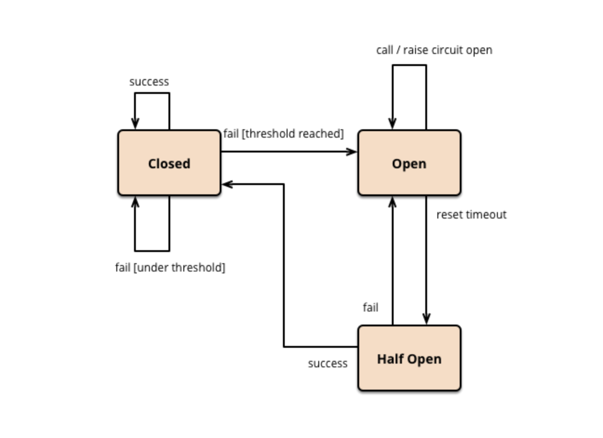

### Kafka

> Pub-sub`Publish - Subscribe (발행/구독)`모델의 분산 메시징 시스템 (메시지 큐). 

`producer`는 `broker`를 통해 `topic`에 `event(message)`를 `publish`하고, 
`consumer`는 해당 `topic`을 `subscribe`해 `broker`에서 `event(message)`를 가져와(`poll`) 처리한다.

기존의 메시징 시스템의 경우 브로커가 컨슈머에게 데이터를 전달해주는 "Push 방식"을 채택한 경우가 많이 있지만. 카프카는 컨슈머가 브로커에게서 메시지를 가져오는 "Pull 방식"을 채택했다.

이러한 방식은 Loosely coupled, Scalable, 관심사 (interest)에 집중할 수 있다는 장점이 있다.

topic 은 여러 파티션(partition) 으로 나눠질 수 있는데, 파티션에는 메시지가 Round-robin(RR) 방식으로 쓰여진다. 순차적으로 메시지가 쓰여지지 않을 수 있다는 점을 인지하자.

가용성을 위해 Consumer group을 구성할 수 있으며, 여러 consumer가 동일한 partition 을 바라볼 수는 없다. (메시지 처리 순서 보장)

한 partition 을 담당하는 consumer 가 다운되면, group 내의 다른 consumer가 다시 처리할 수 있다, 이를 Rebalance 라고 한다. 

Zookeper 와 같은 분산 어플리케이션을 위한 코디네이션 시스템을 통해 이전에 소비했던 offset 위치를 기억하고, 혹시나 consumer가 죽었다가 다시 살아나도, 마지막으로 읽었던 위치에서 부터 다시 읽어들일 수 있다. (fail over 신뢰)

그 외 Broker, Controller broker 장애등은 [링크](https://velog.io/@jwpark06/%EC%9E%A5%EC%95%A0%EC%97%90-%EB%8C%80%EC%9D%91%ED%95%98%EB%8A%94-Kafka) 를 참고해보자.

_항상 정보가 최신일거라는 신뢰를 위한 방식의 `zero payload` 방식도 참고 해보자._

<br>

---

### Zipkin

> MSA 환경에서 어느 구간에서 이슈가 발생했는지 추적하기 위해 '분산 로그 추적 시스템' 중 하나, 트위터에서 개발 된 가장 활성화 된 오픈소스

클라이언트가 서버로 호출한 하나의 호출을 `Trace` 라고 했을 때, 서비스간의 호출을 `Span`이라고 한다. 

각 서비스 컴포넌트들은 하나의 클라이언트 호출을 추적하기 위해서 같은 `Trace Id`를 사용하고, 각 서비스간의 호출은 각각 다른 `Span Id`를 사용한다. 이렇게 함으로써 전체 트렌젝션 시간을 `Trace`로 추적이 가능하고, 각 서비스별 구간 시간은 `Span`으로 추적할 수 있다.

이 추적은 HTTP request가 들어오는 시점과 HTTP request가 다른 서비스로 나가는 부분을 랩핑하여 Trace와 Span Context를 Header 를 통해 전달하는 방식으로 처리된다.

Zipkin 라이브러리는 수집된 트렌젝션 정보를 zipkin 서버의 collector 모듈로 전송한다. 이 때 다양한 프로토콜을 사용할 수 있는데, 일반적으로 HTTP를 사용하고, 시스템의 규모가 클 경우에는 Kafka 큐를 넣어서 Kafka 프로토콜로 전송이 가능하다.

In-memory, MySQL, Cassandra, Elastic Search 스토리지를 사용할 수 있다.

_driver = noop 등 옵션들을 살펴볼 것,  cassandra (카산드라 부하 방지를 위해 kafka 로 쏘는 등의 처리 가능) 도 !_

<br>

---

### API Gateway

> API 서버들의 end-point 를 단일화 해주는 서버

객체 지향의 Facade Pattern 과 유사하지만, 이는 분산 된 시스템의 일부라는 점이 다르다. 클라이언트 앱의 요구사항을 반영해 설계 되었다면 [BFF](https://samnewman.io/patterns/architectural/bff/) 와도 유사하다고 볼 수 있다.


인증 및 인가, 요청 절차의 단순화, 모니터링, 라우팅 및 로드밸런싱, 시스템의 내부 아키텍처 은닉, 캐싱 등의 장점이 있다.

API Gateway 서비스를 사용하면, 내부에 인증 서비스를 추가로 제공하는 경우가 대부분이며, 특정 Domain, 지정된 IP 에만 접근이 가능하도록 private 하게 처리하는 ACL 방법도 있다. 

OAuth2 방식 JWT 를 이용해 인증을 구현하는 게 보편적이다.

<br>

---

### SAGA Pattern

> 각 서비스의 로컬 트랜잭션을 순차적으로 처리하는 패턴

MSA 환경에서 여러 서비스간의 데이터 일관성이 유지 될 필요가 있는 상황이 있다. 이러한 분산 트랜잭션 관리에 대해 보통 2PC`two phase commit` 와 같은 기법이 사용되곤 했다.

```
2PC 란 일반 Commit 과정에 추가로 Prepare Phase 가 추가적으로 존재해 붙은 이름이다.

Transaction Coordinatior 가 여러 노드에 Prepare 명령을 전달하고, Prepared Ack 을 전달받는 방식.
```

각 서비스의 일부 장애나, 각 서비스의 Lock 사용이 시스템 안정과 퍼포먼스 부분에 문제가 있기에 고안 된 방법이 SAGA 패턴이다.

SAGA 패턴은 트랜잭션 관리 주체가 DBMS 가 아닌 Application 에 있다. 각 App 은 local transaction 만 관여해 처리하며, 처리가 완료 됐다는 Event 를 다른 Application 에 전달한다.

실패 Event 또한 존재하며, 이 실패 케이스를 위한 Rollback 처리(보상 트랜잭션)를 Application 에 구현해야한다.

Kafka와 같은 메시지 큐를 이용해서 비동기 방식으로 Event를 전달하는 Choreography-Based Saga 방식과,

트랜잭션 처리를 위한 Saga 인스턴스(Manager)가 별도로 존재하는 Orchestration-Based Saga 방식이 있다.

<br>

---

### Hexagonal Architecture

> 고수준의 비지니스 로직을 표현하는 내부 영역과 인터페이스 처리를 담당하는 저수준의 외부 영역으로 나눈 아키텍처

Port & Adapter Architecture 라고도 부르는 이 방식은 계층형 구조(Layered Architecture)의 DIP 원칙을 만족하지 못하는 상황에서 고안됐다.

계층형 구조에서 DIP 원칙을 만족시키기 위해 Interface 등을 통해 의존성을 줄인다. 그렇지만 이 방식으로 프로그램을 구현할 때 OCP 원칙을 만족시키는 경우는 거의 없다.

고수준의 모듈이 저수준 모듈의 변경 등에 영향을 받지 않아야 되는데, 이런 경우가 거의 없다는 것이다. 

헥사고널 구조는 고수준의 내부 영역이 어댑터에 전혀 의존하지 않게 한다는 것이 목적이다. 

외부에서 들어오는 요청을 처리하는 인 바운드 어댑터(Inbound Adapter)와 비지니스 로직에 의해 호출되어 외부와 연계되는 아웃바운드(Outbound Adapter) 어댑터로 구성 된 외부 영역,

순수한 비지니스로직, 외부영역과 연계되는 포트로 구성된 내부영역으로 냐눠져있다.

이 포트에도 인 바운드 포트, 아웃바운드 포트가 있는데, 외부 영역의 인 바운드 어댑터가 호출하는 인 바운드 포트는 내부 영역 사용을 위해 표출된 API이며, 아웃바운드 포트는 내부 영역이 외부를 호출하는 방법을 정의한다.

여기서 DIP 원칙과 같이 아웃바운드 포트(상위 모듈, 고수준 모듈)가 외부의 아웃바운드 어댑터(하위 모듈, 저수준 모듈)를 호출하여 외부 시스템과 연계하는 것이 아니라 아웃바운드 어댑터가 아웃바운드 포트에 의존하여 구현된다.

<br>

---

### Consul

> 클라우드 환경에서 MicroService Architecture 에서 서비스간 통신을 위한 메커니즘 구현을 쉽게 해주는 툴

클라우드 운영 모델에서 서비스 기반 네트워킹을 위한 중앙 서비스 레지스트리로서 클라우드 네트워크 자동화의 기반을 제공한다.

Service Registry, Health monitoring, Network middleware automation, Zero trust network with service mesh (사이드카 프록시) 등의 기능이 있는데, 현재 Service Registry, RCS(Remote Configuration Server) 용도로 사용중이다.

환경설정 속성들은 주로 dev, beta, prod 등과 같이 여러 개의 프로파일로 운영되는데, 이런 속성들은 마이크로서비스 인스턴스가 많을 땐 관리가 어려워진다. 이 속성들을 외부화하고 중앙 집중화해서 여러 환경에 배포되는 Client 에 적절하게 사용할 수 있다.

<br>

---

### Fluentd

> 로그(데이터) 수집기(collector). 보통 로그를 수집하는 데 사용하지만, 다양한 데이터 소스(HTTP, TCP 등)로부터 데이터를 받아올 수 있다

Fluentd로 전달된 데이터는 tag, time, record(JSON) 로 구성된 이벤트로 처리되며, 원하는 형태로 가공되어 다양한 목적지(Elasticsearch, S3, HDFS 등)로 전달될 수 있다.

ELK stack의 Logstash 역할을 맡고있는 셈이다. Logstash 같은 경우 보편화된 ELK stack 의 일부라 Fluentd 보다 선호되는 경향이 있지만, Fluentd와의 차이가 정말 근소할 만큼 좁혀졌다.

Logstash 의 경우 공식 플러그인이 약 250개로 Fluentd 보다 8배나 많다는 점이 있지만, 장애시 지속성을 위해 메모리 큐 외에 Redis 나 Kafka 와 같은 외부 큐에 의존적이란 평이 있다.

이에 반해 Fluentd 는 인메모리, 디스크를 활용한 고도화된 버퍼를 제공한다.

<br>

---

### envoy

> 대형 MSA의 단일 Application과 Service를 위해 설계된 고성능 분산 c++프록시

MSA 환경에서 라우팅이나, 인증 등의 기능이 소프트웨어 레이어에서 구현되었는데, 이 부분은 개발 능력에 따라 아키텍처의 성숙도의 편차가 심해졌다.
또한 서비스간의 통제 기능이 어플리케이션에 붙게 되며, 기술면의 종속성이 높아지는 문제도 야기했다.

서비스간 라우팅, 헬스체크등의 통제 기능을 프록시 서버와 같은 인프라 서버에서 구성될 수 있는 기능이었고, 해당 Proxy server 의 기능을 다룬 오픈소스중 하나가 바로 Envoy 이다.

IP 나 Port 를 기반으로 동작하는 L4에 반해 Request 를 읽고 파싱하며, 헤더의 정보를 읽고 Response 를 Back-end 로 부터 받아와 전달하는 L7 단이기에 성능 감소가 존재한다곤 하지만, Envoy 는 3/4 계층과 7 계층을 유기적으로 관리하며 성능 문제를 해결하는 데 도움을 준다.

또한 Auto retry, circuit breaker, 부하량 제한등 다양한 로드밸런싱 기능, Zipkin 통합을 통한 MSA 서비스간의 분산 트렌젝션 성능 측정 기능 등 이 외에도 많은 기능을 제공한다.

<br>

---

### Sidecar

> 요청이 자체 인프라 계층의 프록시를 통해 마이크로서비스 간에 라우팅 되는 서비스메쉬에서 개별 프록시는 서비스 내부가 아니라 각 서비스와 함께 실행되므로 'sidecar' 라고도 한다.

사이드카 패턴은 서비스 메쉬에서 모든 MSA 컨테이너가 각각에 대응되는 프록시 컨테이너를 가지는 형태를 뜻한다.

컨테이너를 추가로 하나 더 가지면서 관리가 불편하다고 느껴질 수 있지만, 이는 비즈니스 로직에 개발자가 더 집중할 수 있게 만들어준다. 

해당 Proxy 에 보안을 이유로 Nginx reverse proxy 를 붙인다거나, 성능 면의 이슈로 Nginx content cache 를 붙인다거나, 로그 등을 위해 위에 기록한 Fluentd 나 Logstash 를 추가적으로 붙일 수도 있다. 

MSA 의 단점(커지는 시스템 속 많아지는 마이크로서비스들 관리의 어려움) 을 보완하기 위해 쓰이는 Service Mesh 기술의 L7 계층의 Proxy 를 통해 통신하는 방식에서의 프록시를 뜻하는 용어라고 보면 되겠다.

<br>

---

### Spring cloud netflix

> Spring boot를 기반으로 MSA 구축에 특화된 라이브러리들의 집합인 Spring Cloud 와 Netflix OSS(Open Source Software) 의 교집합

= 서비스들은 동적으로 확장되고 축소되기도 하는 MSA 구조에서 인스턴스의 상태를 동적으로 관리해주는 서비스 디스커버리 서버 역할의 Eureka

- MSA에서 다른 서비스를 호출하는 클라이언트 서비스, 클라어언트 사이드 로드 밸런서 역할의 Ribbon

- 서비스간 호출 사이의 다리 역할을 하는 서킷 브레이커 역할의 Hystrix

- API 게이트웨이 역할의 Zuul

"넷플릭스 당하다(Netflixed)", "넷플릭스 본다(Netflixing)", "넷플릭스 보고 갈래(Netflix and chill)" 등의 신조어가 생길 만큼 높은 인기를 구사하는 넷플릭스에서의 신뢰성 높고 수평 확장이 가능한 클라우드 시스템으로 이전하며 생긴 기술 및 Spring Cloud 에도 영향을 주고 있는 기술들을 일컫는 용어이다.
 
 > 서킷 브레이커란?
 
 외부 API 호출과 같은 remote call시, 호출 실패나 hang 등을 고려해야 한다. 일시적이고 단발성인 오류는 적절히 timeout을 주고 오류를 try-catch 하면 되지만, 오류가 장시간 계속 발생할 때는 이런 방식으로 해결할 수 없는 경우가 있다. 
 
이런 경우 응답을 받지 못한 request가 timeout이 되는 시간까지 쓰레드풀이나 DB풀을 선점하고 있거나, 메모리를 잡아 먹으면서 점차 리소스는 부족해지고, 같은 리소스를 사용하고 있는 다른 부분들에도 순식간에 장애가 전파되기 시작한다.
 
오류가 전파되지 않도록 공유하고 있는 리소스를 분리하는 방법과 오류 발생시 오랫동안 리소스를 잡아두지 못하게 하는 방법이 있는데, 서킷 브레이커는 이중 후자의 방법이다.

Circuit breaker 패턴은 Release It에서 처음 소개된 패턴이고, 전기의 회로차단기에서 차용한 개념이다. _(주가가 폭락했을 때 잠시 시장을 멈춰 냉정한 판단을 할 시간을 두자는 취지로 도입된 제도, 사이드카도 증권사 용어 인 듯...)_
 
회로가 close 될 때는 정상적으로 전기가 흐르다가 문제가 생기면 회로를 open 하여 더이상 전기가 흐르지 않도록 한 것과 같이, 평소(Close state)에는 정상적으로 동작하다가, 오류 발생시(Open state) 더이상 동작하지 않도록 합니다. 
 
기능이 복구되면 다시 서비스를 정상화시켜야 하는데, 무턱대고 정상 상태(Close state)로 돌리면 request가 갑자기 몰리면서 문제가 다시 있다. 그래서 일부 request만 실행해보면서 기능이 다시 정상적으로 동작하는지 확인하는 과정인 반 열림 상태(Half open state)가 있다. 
 
 
_열림, 닫힘, 반열림 상태_
 
 <br>
 
---

### Rancher

> 컨테이너 워크로드를 보다 쉽게 관리할 수 있도록 도와주는 멀티 클러스터 관리 플랫폼

서비스를 관리하고 유지보수를 편하게 하기 위한 기능들이 내포 된 도커 컨네이너 오케스트레이션 서비스(대표적으로 Kubernetes, Apache Mesos, Docker Swarm)를 조금 더 쉽게 설치 하고 통합 관리(모니터링)까지 할 수 있는 통합 관리툴이라고 보면 된다.

Stack, Service, Container 별로 CUI, GUI 를 제공하며 관리에 유용하다.

<br>

---

### Datadog

> 버, 데이터베이스, 클라우드 서비스 등에 대한 다양한 모니터링 서비스를 제공하는 클라우드 모니터링 애플리케이션

데이터베이스, 캐시 스토어 등 다양한 애플리케이션에 대한 추가적인 메트릭 수집과 모니터링을 지원하며, 알림, 대시보드, 로그 수집, APM 기능을 포함한 종합 모니터링 서비스로 확장 중이다.

AWS 의 모니터링 서비스인 Cloudwatch, Newrelic, Zabbix 와 같은 모니터링 서비스지만, 다양한 서비스(언어)가 존재하는 MSA 환경에 초점을 맞춰 특성화된 뷰를 제공하며 후발주자지만 가장 큰 APM 회사로 성장했다.

<br>

---

### Harbor

> Private Docker Registry

도커에선 Docker Hub 라는 공용 도커 이미지 저장소, 관리 서비스를 제공하고 있다. 그러나 개인 또는 기업에선 누구나 접근이 가능한 곳이 아닌 사적인 저장소 시스템이 필요하다.

Harbor는 private 한 docker registry(레지스트리는 Docker 이미지를 저장하고 배포 할 수있는 확장 성이 뛰어난 상태 비 저장 서버 측 애플리케이션) 오픈소스이다.

CLI 환경에서만 사용할 수 있는 Docker registry 를 Web 기반 UI 와 결합하여 효율적인 관리 시스템을 제공한다.

<br>

---

### CDC (Change Data Capture)

> 데이터베이스 내 데이터에 대한 변경을 식별해 필요한 후속처리(데이터 전송/공유 등)를 자동화하는 기술 또는 설계 기법이자 구조

말 그대로 변경된 데이터를 캡쳐하는 것을 의미한다. 

Micro Service Architecture 에서 나아가 Event Driven Architecture는 이벤트를 발행하고 소비하는 패턴을 차용한다.

이를 통해 느슨한 결합과 높은 확장성을 제공할 수 있는데, 이 때 Datasource 로 부터 변경 된 데이터를 캡처하여 CDC Platform 을 통해 전송한다.

CDC Platform 이란 해당 기능을 제공하는 Application 이라고 볼 수 있는데, 대표적으로 Kafka connect 를 들 수 있다.

데이터를 읽고, 데이터를 가공하고, 데이터를 전달하는 포맷으로 컨버팅 하는 구조로 이루어져 있으며, Application Layer가 아닌 Persistence Layer 기반의 이벤트이기에 Service 간 트랜잭션이나, 서비스간의 신뢰도를 고려하지 않아도 된다는 장점을 갖고있다.

<br>

---

<br><br>

## AWS Service

---

### EBS (Elastic Block Store)

> EC2 instance 에 직접 붙혀서 사용하는 볼륨형 스토리지

Magnetic storage, SSD, HDD 타입이 있는 일종의 하드디스크, 말 그대로 블록 저장소.

Raid 1, Raid 2 .. 등 여러 저장소와 함께 사용 가능하다. 하드디스크 볼륨과 같이 파일시스템 유형으로 포맷해 사용할 수 있다.

<br>

---

### EFS (Elastic File System)

> EC2 instance 에 사용할 수 있는 간단하고 확장 가능한 파일 스토리지

EBS 보다 많이 비싸지만, 여러 EC2 인스턴스에서 접근 가능하며, 고가용성의 서비스이다. 

직접 연결해 사내 서버 등에도 연결이 가능하며, 파일 서비스란 점은 EBS 와 동일하다.

<br>

---

### S3 (Simple Storage Service)

> 파일 서버의 역할을 하는 객체 저장 서비스

파일 시스템이 아닌 객체를 저장하는 저장소이다. 퍼미션, 자물쇠 등 기능을 가질 수 없단 것을 의미한다. (파일과 폴더 개념이 없단 것은 아님)

이미지와 비디오등 정적인 파일이나, 로그들을 저장하는 데도 상당히 유용하다. 데이터 손실이 사실상 불가능하다고 말할 정도로 안정적이며, 역시 고가용성의 서비스이다. (EBS 보다 저렴..)

<br>

---

### ECR (EC2 Container Registry)

> Docker Container 의 이미지를 저장하는 Repository 서비스

기능은 Docker hub 의 Repository 서비스와 동일하다. 위에 작성한 Harbor 처럼 Docker Private Repository 역할이며, 구축하고 관리 하는 수고를 AWS 에 맡기는 Managed 서비스일 뿐이다.

Container 이미지를 S3 에 저장하기 때문에 고가용성이 유지되고, AWS IAM 인증을 통해 이미지 push/pull 에 대한 권한 관리가 가능하다는 장점이 있다.

<br>

---

### ECS (Elastic Container Service)

> Container Service로 OS를 포함하지 않아 가볍고, 빠른 배포, 빠른 기동이 가능한 컨테이너 오케스트레이션 서비스

Kubernetes나 Docker Swarm 와 같은 오케스트레이션 툴이라고 보면 된다. 

클러스터를 관리하기 위한 별도의 인스턴스를 구성 & 관리 하지 않아도 되며, 클러스터 관리에 대한 추가적인 비용도 발생하지 않는다. Fargate 라는 유형을 사용하면, EC2 인스턴스로 클러스터를 관리할 필요 없이 ECS 에 통합 돼 관리도 할 수 있다.

<br>

---

### Redshift

> AWS가 서비스하는 클라우드 데이터 웨어하우스 DB

기존의 데이터웨어 하우스보다 10배 빠른 성능으로 서비스를 제공하며, PostgreSQL을 기반으로 만들어져 쿼리를 통해 실행도 가능합니다. 

온프레미스에서 쿼리툴을 통해 레드프레스에 쿼리를 실행하면, 레드프레스는 데이터를 분석, 가공해 기업에게 필요한 정보로 리턴해줍니다.

데이터 과학 분야가 발달하며 마케팅 면에도 큰 이점을 주고 있으며 현재 시장 파악에도 큰 편리성을 제공한다.

<br>

---

### DMS (Database Migration Service)

> AWS에서 제공하는 RDB 마이그레이션 서비스

on-premise to on-premise 외 rds, on-premise, rdb on ec2 간의 마이그레이션 기능을 제공한다.

마이그레이션을 통해 한 번 수행할 수 있으며, 지속적인 변경 사항을 복제하여 소스와 대상을 동기화 상태로 유지할 수도 있다.

변경사항을 감지해 Kafka event 를 발행하는 기능도 포함하고 있으며 CDC 기능을 DMS 로 구현이 가능하다.

<br>

---

### RDS (Relational Database Service)

> AWS가 서비스하는 분산 관계형 데이터베이스

데이터베이스 소프트웨어를 패치하거나 데이터베이스를 백업하거나 시점 복구를 활성화하는 것과 같은 복잡한 관리 프로세스들은 자동으로 관리해준다.

EC2 에 DB 를 직접 설치하고 사용하는 것 보다 비용이 더 드는 건 사실이지만, 상용 서비스 환경에서의 운영, 환경설정, 스케일링 등의 설정을 단순케 해준다는 이점이 있다.

<br>

---

### Aurora 

> AWS 가 mysql, postgresql 을 호환해 만든 RDBMS

AWS Aurora는 Shared Storage를 사용하며 MySQL의 경우 Binlog 기반의 Replication이 아닌 Storage와 Page 기반의 Replication을 사용한다.

RDS 의 경우 자신의 EBS 로 데이터를 쌓고 쌓은 데이터를 EBS 로 미러링 한 다음 Replication 을 통해 Replica 로 데이터를 보내고, 그 데이터를 다시 EBS 로 쌓는다.

반면 오로라는 쿼럼이란 것을 사용해 스토리지로 저장하며 레플리카로 보내는 것은 redo log 이다. 많은 Write 명령이 많은 인스턴스의 경우 오로라를 사용하면 레플리카 lag를 적게 가져갈 수 있으며, 적은 network bandwidth 로 빠르게 변경분을 저장하고 반영할 수 있다.

<br>

---

### DynamoDB 

> AWS에서 제공하는 NoSQL DB 솔루션

NoSQL 데이터베이스를 사용해봤다면 익숙한 Key-value 형식의 데이터베이스이며 보조인덱스를 통해 빠른 조회를 지원한다.

Table, Item, Attribute 형태로 이루어져 있으며 key-value 형식의 Attribute들이 모여 Item, Item 들이 모여 Table이 되는 형식이다.

Table 에는 기본키를 지정해야하고, Item은 기본 키는 필수이며 복합키와 기타 속성을 가질 수 있다. 

<br>

---

### Elastic cache

> 분산 인 메모리 캐시(In-Memory-Cache)를 손쉽게 생성하고 확장할 수 있는 서비스

인 메모리 캐시는 디스크에 접근 하지 않고, 메모리(RAM) 에만 데이터를 저장하기 때문에 저장 및 검색속도가 매우 빠르다.

Redis 와 Memcached 를 지원하며, 손쉬운 배포와 RDS, DynamoDB, EC2, Cloudwatch, SNS(Simple notification service) 등과도 원활하게 연동되는 장점도 갖고있다.

<br>

---

## LDAP

> LDAP(Lightweight Directory Access Protocol)은 분산 디렉터리 서비스에서 사용자, 시스템, 네트워크, 서비스, 앱 등의 정보를 공유하기 위한 오픈 프로토콜이다.

검색에 특화된 ldap 은 컴퓨터 및 사용자 인증 등의 정보를 중앙에서 관리할 수 있으며 수 많은 계정 및 접근관리에 용이해 보안 결함 관리에도 효율적이다.

AD (Active Directory) 와 중앙 서버에 공유 DB를 사용자들이 사용할 수 있게 두는 점이 상당히 유사하다. 모두 디렉터리 서비스를 이용할 수 있는 프로그램이며 중앙에서 리소스를 관리할 수 있다.

하지만 LDAP은 `프로토콜`이고 거의 모든 OS에 디렉터리 서비스를 지원하지만 검색에 특화되어 있고 DB처럼 쓰기 동작에는 적합하지 않다. 반면 AD는 디렉터리 서비스 공급자이며 LDAP을 포함한 여러 프로토콜을 지원한다. 검색뿐만 아니라 쓰기에도 적합하며 네트워크 규모에 관계없이 많이 사용되지만 Windows 환경만 지원한다.

모든 OS 에 지원되지만, 주로 리눅스 기반의 OpenLDAP 을 많이 이용한다.

<br>

---


<br>

_참고_
- Kafka
  - _https://bcho.tistory.com/1016_
  - _https://medium.com/@umanking/%EC%B9%B4%ED%94%84%EC%B9%B4%EC%97%90-%EB%8C%80%ED%95%B4%EC%84%9C-%EC%9D%B4%EC%95%BC%EA%B8%B0-%ED%95%98%EA%B8%B0%EC%A0%84%EC%97%90-%EB%A8%BC%EC%A0%80-data%EC%97%90-%EB%8C%80%ED%95%B4%EC%84%9C-%EC%9D%B4%EC%95%BC%EA%B8%B0%ED%95%B4%EB%B3%B4%EC%9E%90-d2e3ca2f3c2_
  - _https://sowhat4.tistory.com/71_
  - _https://velog.io/@jwpark06/%EC%9E%A5%EC%95%A0%EC%97%90-%EB%8C%80%EC%9D%91%ED%95%98%EB%8A%94-Kafka_
  
- MSA, API gateway
  - _https://docs.microsoft.com/ko-kr/dotnet/architecture/microservices/architect-microservice-container-applications/direct-client-to-microservice-communication-versus-the-api-gateway-pattern_
  
- Clean Architecture, hexagonal
 - _https://engineering-skcc.github.io/microservice%20inner%20achitecture/inner-architecture-2/_

- Consul, RSC
  - _https://woowabros.github.io/tools/2018/10/08/location-service-with-rcs.html_

- Fluentd
  - _https://grip.news/archives/1340_
  
- Envoy
  - _https://gruuuuu.github.io/cloud/envoy-proxy/_
  - _https://bcho.tistory.com/1253_
  
- Spring Cloud Netflix
  - _https://www.s-core.co.kr/insight/view/spring-cloud-netflix%EB%A1%9C-%EC%95%8C%EC%95%84%EB%B3%B4%EB%8A%94-microservices-architecture-msa%EC%99%80-%EB%84%B7%ED%94%8C%EB%A6%AD%EC%8A%A4/_

- Circuit breaker 
  - _https://bcho.tistory.com/1247_
  
- CDC
  - _https://www.kdata.or.kr/info/info_04_view.html?field=&keyword=&type=techreport&page=3&dbnum=189554&mode=detail&type=techreport_
  - _https://hyperconnect.github.io/2021/01/11/cdc-platform.html_
