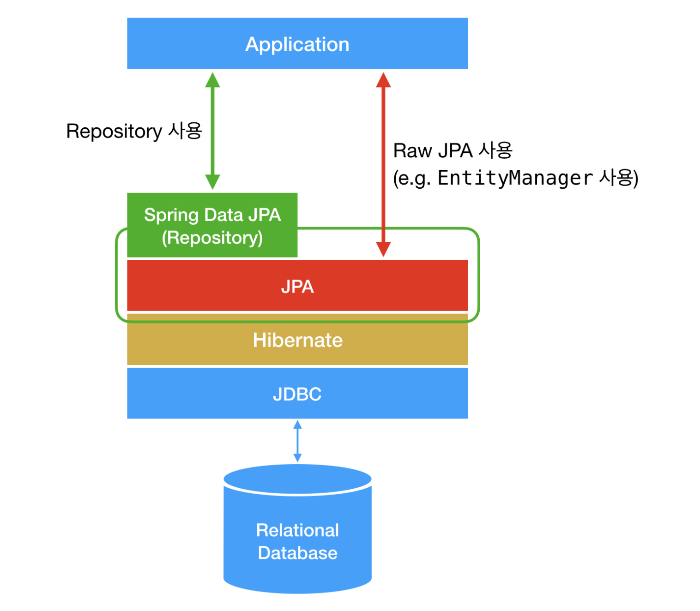

## JPA

### JPA는 기술 명세이다

JPA는 Java Persistence API의 약자로, 자바 어플리케이션에서 관계형 데이터베이스를 사용하는 방식을 정의한 인터페이스이다. 

JPA는 단순히 명세이기 때문에 구현이 없다. 라이브러리가 아닌 정말 인터페이스이다.

JPA의 핵심이 되는 EntityManager는 javax.persistence.EntityManager 라는 파일에 interface로 정의되어 있다.

## Hibernate

### Hibernate는 JPA의 구현체이다

JPA를 사용하기 위해서 반드시 Hibernate를 사용할 필요가 없다. 단지 Hibernate가 굉장히 성숙한 라이브러리이기 때문이다.

위에서 언급한 javax.persistence.EntityManager와 같은 인터페이스를 직접 구현한 라이브러리이다. JPA와 Hibernate는 마치 자바의 interface와 해당 interface를 구현한 class와 같은 관계이다.

## Spring Data JPA

### Spring Data JPA는 JPA를 쓰기 편하게 만들어놓은 모듈이다

DB에 접근할 필요가 있는 대부분의 상황에서는 Repository를 정의하여 사용했다. 이 Repository가 바로 Spring Data JPA의 핵심이다.

개발자가 JPA를 더 쉽고 편하게 사용할 수 있도록 도와준다. 이는 JPA를 한 단계 추상화시킨 Repository라는 인터페이스를 제공함으로써 이루어진다.

사용자가 Repository 인터페이스에 정해진 규칙대로 메소드를 입력하면, Spring이 알아서 해당 메소드 이름에 적합한 쿼리를 날리는 구현체를 만들어서 Bean으로 등록해준다.

Spring Data JPA가 JPA를 추상화했다는 말은, Spring Data JPA의 Repository의 구현에서 JPA를 사용하고 있다는 것이다. 

Repository 인터페이스의 기본 구현체인 SimpleJpaRepository의 코드를 보면 내부적으로 EntityManager을 사용하고 있는 것을 볼 수 있다.

_JPA, Spring Data JPA, Hibernate_

## Entity Manager

엔티티 매니저는 특정 작업을 위해 데이터베이스에 액세스 하는 역할을 가진다. 엔티티 매니저 내부에 영속성 컨텍스트(Persistence Context)라는 걸 두어서 엔티티들을 관리한다.

엔티티 매니저는 여러 스레드가 동시에 접근하면 동시성 문제가 발생하므로 스레드 간에 절대 공유하면 안 된다.

Spring 컨테이너가 초기화되면서 @PersistenceContext 애노테이션으로 주입받은 EntityManager를 Proxy로 감싼다. 이후 EntityManager 호출 시 마다 Proxy를 통해 EntityManager를 생성 하여 Thread-Safety를 보장 한다.

## CrudRepository

CrudRepository는 관리되는 엔티티 클래스에 대해 정교한 CRUD 기능을 제공한다. 

JPA 처리를 담당하는 Repository는 기본적으로 4가지가 있다. 

- Repository<T, ID>
- CrudRepository<T, ID>
- PagingAndSortingRepository<T, ID>
- JpaRepository<T, ID>

[ 스프링 데이터 모듈 ]

      Repository

          |

    CrudRepository

          |

PagingAndSortingRepository

          |

[ 스프링 데이터 JPA 모듈 ]

          |    

    JpaRepository (+ 추가로 JPA에 특화된 기능 제공)

_참고_

- https://suhwan.dev/2019/02/24/jpa-vs-hibernate-vs-spring-data-jpa/
