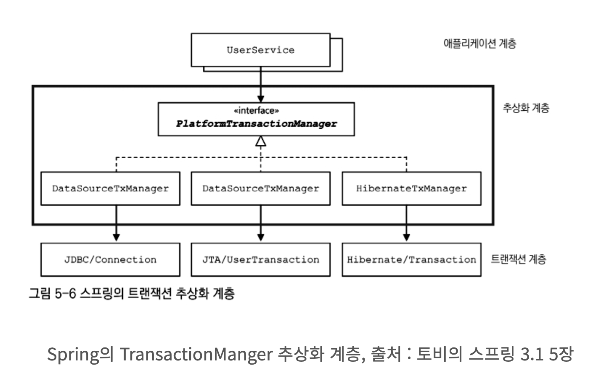

# PSA (Portable Service Abstraction)

Spring 의 AOP 는 Proxy 패턴을 발전시켜 만들어 졌다. 그리고 `FactoryBean`을 통해 Proxy 가 Bean 이 생성될 때 자동으로 생성된다.

@Transactional 어노테이션을 선언하는 것 만으로 별도의 코드 추가 없이 트랜잭션 서비스를 사용할 수 있다. 그리고 내부적으로 트랜잭션 코드가 추상화되어 숨겨진다.

이렇게 추상화 계층을 사용하여 어떤 기술을 내부에 숨기고 개발자에게 편의성을 제공해주는 것이 서비스 추상화(Service Abstraction)입니다.

DB에 접근하는 방법은 여러가지가 있습니다. 기본적으로 Jdbc 를 통해 접근(DatasourceTransactionManager)할 수 있으며 ORM 을 이용하고자한다면 JPA(JpaTransactionManager)를 통해서 접근할 수 있습니다. 

신기하게도 어떠한 경우라도 @Transactional 어노테이션을 이용하면 트랜잭션을 유지하는 기능을 추가할 수 있습니다. 

또 다른 예시들을 보자. 

@Controller 어노테이션을 사용하면 요청을 Mapping 할 수 있는 Controller 역할을 수행할 수 있다. 해당 클래스 안에 @GetMapping, @PostMapping 등과 같은 어노테이션으로 요청을 Mapping 합니다

Spring Boot 기반의 Application 은 tomcat 을 기반으로 동작하는데, Spring5 에는 WebFlux 라는 기술도 있다.

기존의 Spring Web MVC 와 거의 흡사한 방법으로 코딩을 하지만 기술이 완전히 다르다. 

기존의 Servlet 처럼 하나의 요청당 하나의 Thread 를 사용하는 구조가 아니라 CPU 갯수만큼의 Thread 를 유지하면서 Thread Pool 을 사용하며 최소한의 Thread 를 이용하여 가용성을 높이는 프로그래밍 방법이다.

이 때는 tomcat 이 아닌 Netty 기반으로 실행할 수도 있다.

Spring Cache Manager, Cache 또한 @Cacheable, @CacheEvict 와 같은 어노테이션을 이용하여 구현체는 신경 쓰지 않고 javax.cache, ehcache 등의 기술을 바꾸어 사용할 수 있습니다.

이렇게 하나의 추상화로 여러 서비스를 묶어둔 것을 Spring 에서 `Portable Service Abstraction` 이라고 한다.

_참고_
- _https://sabarada.tistory.com/127_
