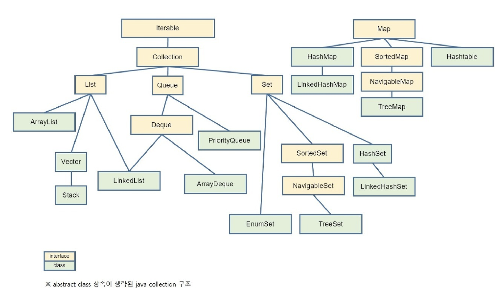

# Java Collection 자료구조



_콜렉션 자료구조_

## 컬렉션 프레임워크(Collection Framework)

컬렉션 프레임워크는 자바에서 데이터를 저장하는 클래스들을 표준화한 설계 구조를 말합니다. 이러한 구조를 바탕으로 자바의 기본 자료구조 클래스들이 구성되어 있으며 체계화되고 일관된 구조를 가지게 되었습니다.

자바에 Collection 자료구조는 크게 List , Set , Map 3가지로 나눌 수 있다.

그중 Collection 인터페이스를 상속하는 자료구조는 List , Set 

Map은 기본적으로 Key, Value 라는 다른 구조를 가지기 때문에, 독립적인 인터페이스가 구현되어 있다.

**Collection 인터페이스를 상속하는 클래스들을 Collections 라고 부릅니다**. 자바에서 해당 Collections 를 사용법을 아는것도 중요하지만, 어느정도의 시간복잡도와 성능을 가지는지도 중요.


---

## List 인터페이스

index 라는 식별자로 순서를 가지며, 데이터의 중복을 허용하는 자료구조.

### ArrayList

ArrayList는 List 인터페이스를 상속받은 클래스로 크기가 가변적으로 변하는 선형리스트입니다. 
일반적인 배열과 같은 순차리스트이며 인덱스로 내부의 객체를 관리한다는점등이 유사하지만 한번 생성되면 크기가 변하지 않는 배열과는 달리 ArrayList는 객체들이 
추가되어 저장 용량(capacity)을 초과한다면 자동으로 부족한 크기만큼 저장 용량(capacity)이 늘어난다는 특징을 가지고 있습니다.

```java
ArrayList list = new ArrayList();//타입 미설정 Object로 선언된다.
ArrayList<Student> members = new ArrayList<Student>();//타입설정 Student객체만 사용가능
ArrayList<Integer> num = new ArrayList<Integer>();//타입설정 int타입만 사용가능
ArrayList<Integer> num2 = new ArrayList<>();//new에서 타입 파라미터 생략가능
ArrayList<Integer> num3 = new ArrayList<Integer>(10);//초기 용량(capacity)지정
ArrayList<Integer> list2 = new ArrayList<Integer>(Arrays.asList(1,2,3));//생성시 값추가

list.add(3); //값 추가
list.add(1,10); //index 1에 10 삽입
```

index를 생략하면 ArrayList 맨 뒤에 데이터가 추가되며 index중간에 값을 추가하면 해당 인덱스부터 마지막 인덱스까지 모두 1씩 뒤로 밀려납니다.

이 경우 데이터가 늘어나면 늘어날 수록 성능에 악영향이 미치기에 중간에 데이터를 insert를 해야할 경우가 많다면 ArrayList보다는 LinkedList를 활용하시는 것도 좋은 방법입니다.

remove()함수를 사용하여 특정 인덱스의 객체를 제거하면 바로 뒤 인덱스부터 마지막 인덱스까지 모두 앞으로 1씩 당겨집니다. 모든 값을 제거하려면 clear() 메소드를 사용하면 됩니다.


단방향 포인터 구조로 각 데이터에 대한 인덱스를 가지고 있어 조회 기능에 성능이 뛰어남
배열과 달리 초기크기를 지정하지 않아도 되므로, 삽입 삭제가 자유로움

### LinkedList

연결 리스트(LinkedList)는 각 노드가 데이터와 포인터를 가지고 한 줄로 연결되어 있는 방식의 자료구조입니다. 
데이터를 담고 있는 노드들이 연결되어 있고, 노드의 포인터가 이전 노드와 다음 노드와의 연결을 담당합니다. 
Node는 LinkedList에 객체를 추가하거나 삭제하면 앞뒤 링크만 변경되고 나머지 링크는 변경되지 않습니다.
중간에 데이터를 추가나 삭제하더라도 전체의 인덱스가 한 칸씩 뒤로 밀리거나 당겨지는 일이 없기에 ArrayList에 비해서 데이터의 추가나 삭제가 용이하나, 
인덱스가 없기에 특정 요소에 접근하기 위해서는 순차 탐색이 필요로 하여 탐색 속도가 떨어진다는 단점이 있습니다. 
그러므로 탐색 또는 정렬을 자주 하는 경우엔 배열을 사용하고 데이터의 추가/삭제가 많은 경우 연결 리스트를 사용하는 것이 좋습니다.

```java
LinkedList list = new LinkedList();//타입 미설정 Object로 선언된다.
LinkedList<Student> members = new LinkedList<Student>();//타입설정 Student객체만 사용가능
LinkedList<Integer> num = new LinkedList<Integer>();//타입설정 int타입만 사용가능
LinkedList<Integer> num2 = new LinkedList<>();//new에서 타입 파라미터 생략가능
LinkedList<Integer> list2 = new LinkedList<Integer>(Arrays.asList(1,2));//생성시 값추가

LinkedList<Integer> list = new LinkedList<Integer>();
list.addFirst(1);//가장 앞에 데이터 추가
list.addLast(2);//가장 뒤에 데이터 추가
list.add(3);//데이터 추가
list.add(1, 10);//index 1에 데이터 10 추가 기존 1에 있던 녀석은 뒤 노드와 연결이 끊어져버림.

list.remove(1); //index 1 제거  삭제 대상 노드의 이전의 노드가 삭제 대상 노드의 다음의 노드를 가리키게 하고 해당 노드는 삭제 됩니다.
```

- 양방향 포인터 구조로 데이터의 삽입, 삭제가 빈번할 경우 데이터의 위치정보만 수정 하면 되기에 유용
- 스택, 큐, 양방향 큐 등을 만들기 위한 용도로 쓰임


## Set 인터페이스

순서가 없고, 데이터 유일성을 가지는 자료구조.  중복을 자동으로 제거

Set은 객체를 중복해서 저장할 수 없고 하나의 null 값만 저장할 수 있습니다. 또한 저장 순서가 유지되지 않습니다.
저장 순서를 유지해야 한다면 JDK 1.4부터 제공하는 LinkedHashSet 클래스를 사용하면 됩니다.


### HashSet

HashSet은 객체를 저장하기 전에 먼저 객체의 hashCode()메소드를 호출해서 해시 코드를 얻어낸 다음 저장되어 있는 객체들의 해시 코드와 비교한 뒤 같은 해시 코드가 있다면 다시 equals() 메소드로 두 객체를 비교해서 true가 나오면 동일한 객체로 판단하고 중복 저장을 하지 않습니다.

HashSet도 저장공간보다 값이 추가로 들어오면 List처럼 저장공간을 늘리는데 Set은 한 칸씩 저장공간을 늘리지 않고 저장용량을 약 두배로 늘립니다. 여기서 과부하가 많이 발생합니다. 그렇기에 초기에 저장할 데이터 갯수를 알고 있다면 Set의 초기용량을 지정해주는 것이 좋습니다.

```java
HashSet<Integer> set1 = new HashSet<Integer>();//HashSet생성
HashSet<Integer> set2 = new HashSet<>();//new에서 타입 파라미터 생략가능
HashSet<Integer> set3 = new HashSet<Integer>(set1);//set1의 모든 값을 가진 HashSet생성
HashSet<Integer> set4 = new HashSet<Integer>(10);//초기 용량(capacity)지정
HashSet<Integer> set5 = new HashSet<Integer>(10, 0.7f);//초기 capacity,load factor지정
HashSet<Integer> set6 = new HashSet<Integer>(Arrays.asList(1,2,3));//초기값 지정
```

- 가장빠른 임의 접근 속도
- 순서를 예측할 수 없음

### TreeSet

HashSet과는 달리 TreeSet은 이진 탐색 트리(BinarySearchTree) 구조로 이루어져 있습니다. 
이진 탐색 트리는 추가와 삭제에는 시간이 조금 더 걸리지만 정렬, 검색에 높은 성능을 보이는 자료구조입니다. 
그렇기에 HashSet보다 데이터의 추가와 삭제는 시간이 더 걸리지만 검색과 정렬에는 유리합니다.

TreeSet은 이진탐색트리 중에서도 성능을 향상시킨 레드-블랙 트리(Red-Black Tree)로 구현되어 있습니다. 
일반적인 이진 탐색 트리는 트리의 높이만큼 시간이 걸리지만, 데이터의 값이 트리에 잘 분산되어 있다면 효율성에 큰 문제가 없으나 데이터가 들어올 때 값이 편향되게 들어올 경우 한쪽으로 크게 치우쳐진 트리가 되어 굉장히 비효율적인 퍼포먼스를 냅니다.
레드 블랙 트리는  부모노드보다 작은 값을 가지는 노드는 왼쪽 자식으로, 큰 값을 가지는 노드는 오른쪽 자식으로 배치하여 데이터의 추가나 삭제 시 트리가 한쪽으로 치우쳐지지 않도록 균형을 맞추어줍니다.

- 정렬 방법을 지정할 수 있음
- 자동정렬

_참고_
- _https://coding-factory.tistory.com/551_
- _https://bangu4.tistory.com/194_

